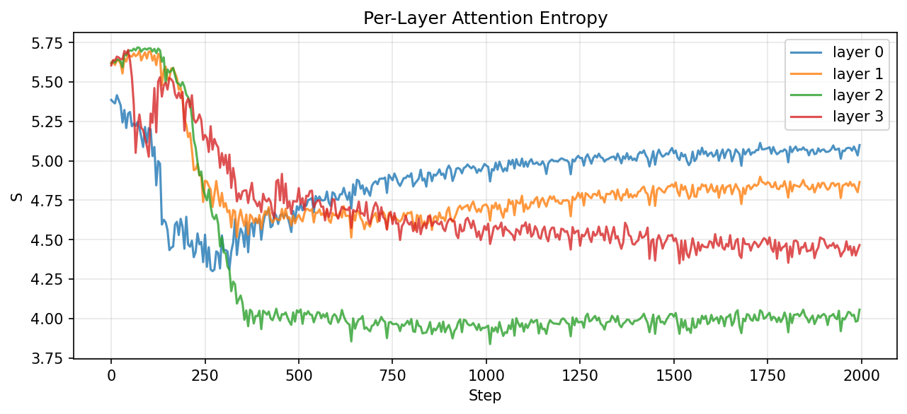
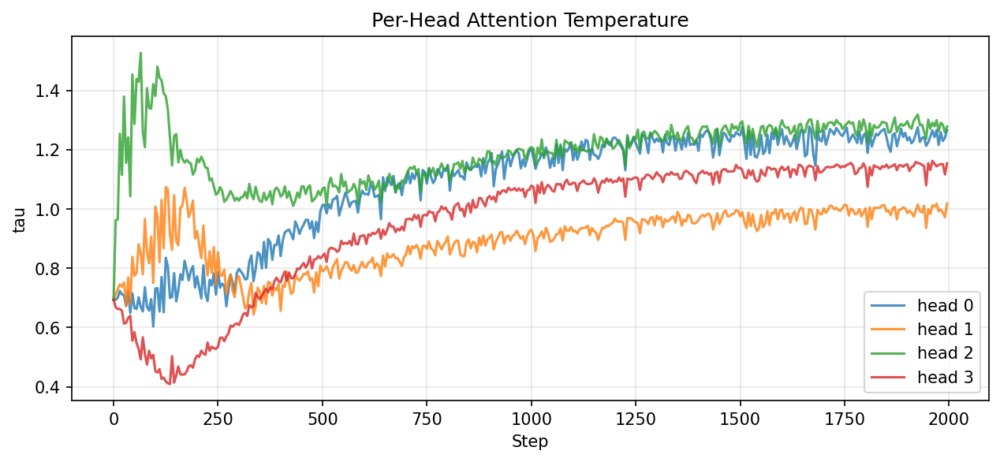
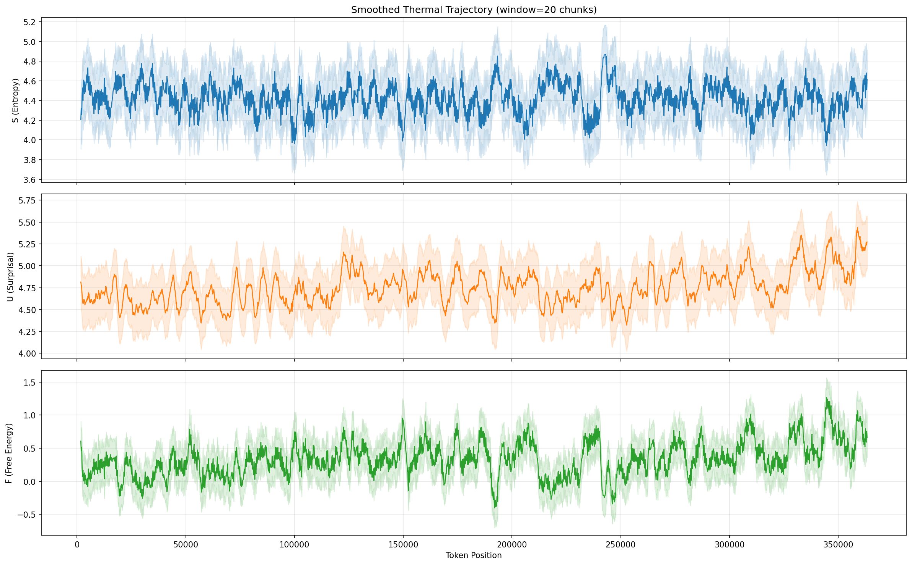

# ThermFormer: Thermodynamic Attention for Narrative State Tracking

**A Novel Transformer Architecture Applying Statistical Mechanics to Attention Temperature Control**

---

## Abstract

ThermFormer is a transformer language model that replaces the fixed attention scaling factor (1/√d) with a dynamic, thermodynamically-motivated temperature parameter per attention head. Three observables — attention entropy (S), token surprisal (U), and free energy (F = U − βS) — are computed at chunk boundaries and fed back into the model, creating a closed-loop system where the model's thermal state influences its own attention patterns.

Trained on a single book corpus (A Game of Thrones, ~365k tokens), the architecture demonstrates genuine head specialization driven by thermodynamic feedback, clear layer-wise entropy stratification, and — most notably — a free energy signal that tracks structural narrative regimes (dialogue vs. descriptive prose) rather than surface-level token statistics. The key finding is that F captures a meaningful axis of narrative structure, though it operates through linguistic modality (dialogue density, vocabulary predictability) rather than directly encoding emotional valence.

---

## 1. Motivation

Standard transformer attention computes:

    Attention(Q, K, V) = softmax(QKᵀ / √d) · V

The term 1/√d acts as an inverse temperature in the Boltzmann distribution sense — it controls how sharply attention concentrates. In standard transformers this temperature is fixed and identical across all heads. ThermFormer asks: what if attention temperature were dynamic, derived from the model's own thermodynamic state, and allowed to vary per head?

The hypothesis is that narrative text exhibits thermodynamic-like regime changes — high-entropy states (ambiguous, multi-topic), high-energy states (surprising, dramatic), and transitions between them — and that making the model aware of its own thermal state should improve both language modeling and enable interpretable tracking of narrative structure.

---

## 2. Architecture

### 2.1 Base Model

- 6 transformer layers, 4 attention heads
- d_model = 256, d_ff = 1024
- Learned absolute positional embeddings
- Vocabulary: 12,000 BPE tokens trained on the corpus
- Pre-LN residual blocks

### 2.2 Thermodynamic Components

**Thermal Embedding.** At each chunk boundary, three scalar observables are computed and discretized into 8 bins:

- S (Entropy): Mean Shannon entropy of attention weights at the last captured layer
- U (Surprisal): Mean negative log-probability of target tokens, −log p(token)
- F (Free Energy): F = U − βS, where β = 1.0

These discretized values are embedded via three separate embedding tables and summed into the token representation alongside positional and token embeddings.

**TauHead.** A small MLP (Dense(32) → tanh → Dense(4) → softplus) takes the previous chunk's (S, U, F) as a 3-dimensional input and outputs a per-head temperature τ_h. Attention is then computed as:

    Attention_h = softmax(QKᵀ / (√d · τ_h)) · V

When τ > 1, attention softens (broader context). When τ < 1, attention sharpens (local focus).

**ThermalPredictor.** A 2-layer MLP that, at each boundary position, predicts the next segment's (S, U, F) from the hidden state at that boundary. This creates a forecasting objective: the model must organize its representations to anticipate the thermal character of upcoming text.

### 2.3 Training Objective

The model is trained with a dual loss:

    L_total = L_LM + λ · L_thermal

where L_LM is standard cross-entropy next-token prediction, and L_thermal is a Huber loss on normalized (S, U, F) predictions at boundary positions. The thermal loss uses boundary-conditioned future prediction: at boundary k, predict the thermal statistics of the segment between boundary k and boundary k+1.

Key training details:
- Cosine LR schedule with linear warmup (100 steps)
- AdamW with gradient clipping (max norm 1.0)
- Thermal loss warmup over first 200 steps
- Per-batch target normalization to handle scale differences between S, U, F
- λ_thermal = 0.15

### 2.4 Data Pipeline

The corpus (A Game of Thrones, ~293k words) undergoes:

1. Raw text cleaning: page number removal, whitespace normalization
2. Chapter heading detection via all-caps heuristic
3. Sentence-aligned chunking at ~220 words per chunk
4. Automated split-word repair via bigram frequency analysis
5. Short chunk merging (minimum 80 tokens)

This produces ~1,293 chunks separated by `<BOUNDARY>` tokens. A BPE tokenizer (vocab 12,000) is trained on the chunks with `<BOUNDARY>` as a protected special token. The token stream is windowed at seq_len=1024 with stride=256, yielding 1,280 training and 143 validation windows.

---

## 3. Experimental Progression

The architecture was developed iteratively over five training runs, each addressing issues discovered in the previous run.

### 3.1 Run 1: Zero-SUF Sanity Check (50 steps)

The first run fed zero values for all thermal inputs to verify the architecture trains without errors. Result: LM loss decreased normally, confirming the thermal plumbing (ThermalEmbed, TauHead, ThermoMHA) doesn't interfere with basic language modeling. Tau heads began diverging even at 50 steps — head 2 rising to ~1.5, head 3 dropping to ~0.5.

### 3.2 Run 2: Same-Pass Thermal Targets (2000 steps)

The thermal predictor was trained to predict S/U/F computed from the same forward pass. Result: LM loss reached 4.0 (good), but thermal loss crashed to near-zero within 10 steps. The predictor learned a trivial mapping from hidden states to deterministic functions of those same hidden states. Tau heads converged — all four drifting toward ~1.5 — indicating the thermal pathway was providing no useful gradient signal.

**Diagnosis:** The thermal objective was a reconstruction task, not a prediction task.


*Figure 1: Thermal loss crashes to zero immediately when predicting same-pass statistics.*

### 3.3 Run 3: Previous-Chunk Targets (2000 steps, λ=0.15)

The thermal predictor was changed to predict the SUF that was fed into the current batch (from the previous chunk). LM loss plateaued at ~5.2 with thermal loss declining gradually. Tau heads showed improved divergence but remained coupled.

**Diagnosis:** The model was learning h_t → z_{t−1} (retrospective summary) rather than h_t → z_{t+1} (future prediction). Better than same-pass reconstruction, but not the intended objective.

### 3.4 Run 4: Probe-Only Future Prediction (500 steps, λ=0.3)

Thermal loss was computed correctly (boundary k predicts segment k→k+1) but only backpropagated through the predictor parameters, not the base model. Result: strong tau divergence (head 3 at 0.4, head 2 at 2.2) but LM loss stalled at 6.5 because λ=0.3 was too aggressive.

**Diagnosis:** Correct objective direction, but thermal gradients weren't shaping the base model's representations.

### 3.5 Run 5: Joint Training with Full Gradient Flow (2000 steps)

Final architecture with vectorized boundary handling, Huber loss, per-batch normalization, thermal warmup, and full gradient flow through all parameters. LM loss reached ~4.5. Layer entropy showed clear 4-band stratification. Tau heads maintained moderate divergence.


*Figure 2: Layer entropy stratifies into four distinct bands. Layer 2 (green) achieves the sharpest attention (~4.0), while layer 0 (blue) maintains broad attention (~5.0).*


*Figure 3: Per-head attention temperature over training. Early divergence (steps 0–200) followed by stabilization. Head 3 (red) consistently runs cooler than others.*


*Figure 4: 20-chunk rolling average of S, U, F across the full book. Clear oscillatory structure visible, particularly in entropy (S) and free energy (F).*

---

## 4. Key Finding: Free Energy Tracks Narrative Modality

The most significant result comes from analyzing which passages produce extreme free energy values.

### 4.1 Lowest Free Energy (Negative F)

Passages with the most negative F exhibit high entropy (S ≈ 5.2–5.9) and low surprisal (U ≈ 3.5–4.0):

| F | S | U | Passage |
|---|---|---|---------|
| −2.11 | 5.90 | 3.79 | "The blood will tell. I have only to remember how your sister set her wolf on my son." |
| −2.01 | 5.69 | 3.68 | He put both hands in her hair and combed it with his fingers... |
| −1.91 | 5.84 | 3.93 | She'd look so small from up there, would they be able to tell who she was? |
| −1.72 | 5.43 | 3.71 | "You're horrible," she screamed at her sister. "They should have killed you instead of Lady!" |
| −1.69 | 5.24 | 3.55 | Outside, there were shouts of "Fire!" in the yard, screams, running footsteps... |
| −1.63 | 5.54 | 3.91 | "Riverrun is free again, Father." Lord Hoster smiled. |
| −1.63 | 5.53 | 3.90 | Sam nodded miserably. "I hate the cold," he said. |

These are **emotionally intense, dialogue-heavy scenes**. The high entropy reflects attention spreading across multiple speakers, quotation marks, and dialogue tags. The low surprisal reflects the predictability of dialogue patterns ("he said," "she replied," established character speech patterns).

### 4.2 Highest Free Energy (Positive F)

Passages with the most positive F exhibit low entropy (S ≈ 0.2–1.5) and high surprisal (U ≈ 4.9–6.1):

| F | S | U | Passage |
|---|---|---|---------|
| 4.64 | 1.49 | 6.13 | I'm the third man he's savaged. Give him the freedom of the castle and it's only a question of time... |
| 4.65 | 0.25 | 4.90 | Perhaps it was just another lie. The crow had promised him that he could fly... |
| 4.66 | 0.93 | 5.59 | The horse was well lathered, so Jon took the lead and walked her for a while. |
| 4.66 | 0.41 | 5.07 | Lord Stannis in particular. His claim is the true one, he is known for his prowess as a battle c... |
| 4.72 | 0.65 | 5.37 | Arya cried out as she saw her father hit. The gold cloaks kept him from falling. Blood ran down... |

These are **descriptive narration and exposition passages**. The low entropy reflects focused attention on specific nouns, locations, and action sequences. The high surprisal reflects rare vocabulary (proper nouns, place names, unusual verbs).

### 4.3 Interpretation

The free energy F = U − βS operates as a **dialogue ↔ narration axis**:

- **Negative F (dialogue-heavy):** High entropy (distributed attention over conversational structure) minus low surprisal (predictable dialogue patterns) = negative. The model is in a "high-entropy, low-energy" thermodynamic state — thermally similar to a gas at moderate temperature with many accessible microstates.

- **Positive F (descriptive prose):** Low entropy (focused attention) minus high surprisal (rare vocabulary) yields positive F, but this means high energy isn't being compensated by entropy — thermally similar to a constrained system with high internal energy.

This is **not** a direct emotion detector. It captures narrative structure through the proxy of linguistic modality. However, in George R.R. Martin's writing style, emotional peaks consistently occur in dialogue-heavy scenes (arguments, revelations, confrontations), which is why the lowest-F passages are also the most emotionally intense.

---

## 5. Architecture Observations

### 5.1 Layer Specialization

The four captured layers (0–3) settled into distinct entropy bands:

- **Layer 0** (S ≈ 5.0): Broad contextual attention — acts as a general context aggregator
- **Layer 1** (S ≈ 4.8): Intermediate — balances local and global attention
- **Layer 2** (S ≈ 4.0): Sharpest attention — likely handles syntactic dependencies
- **Layer 3** (S ≈ 4.5): Moderate — potentially handles semantic/narrative-level patterns

This stratification is controlled by the per-head tau mechanism rather than emerging purely from the LM objective.

### 5.2 Tau Dynamics

Tau heads showed meaningful behavior:

- Early training (steps 0–200): Rapid divergence as heads discover their preferred operating temperatures
- Mid training (steps 200–800): Exploration phase with significant variance, heads responding differently to different content
- Late training (steps 800+): Stabilization around characteristic values

The final run showed less dramatic tau divergence than earlier runs with higher λ_thermal, suggesting a tension between LM quality and thermal specialization pressure.

### 5.3 Thermal Loss Behavior

Across all runs, thermal loss showed a consistent pattern of rapid initial decrease. The boundary-conditioned future prediction task proved learnable but not strongly constraining — the predictor can achieve low loss without forcing deep representational changes in the base model. This suggests that boundary hidden states already contain substantial information about local text statistics, and the thermal prediction objective acts more as a regularizer than a primary shaping force.

---

## 6. Limitations

1. **Single-book corpus.** 365k tokens is insufficient for the LM to learn robust language patterns, limiting the quality of all downstream signals. Val LM loss of ~4.5 means the model is far from capturing the full structure of the text.

2. **Observable design.** S and U are linguistically grounded (attention patterns, token probability) rather than semantically grounded (emotion, topic, tension). The thermodynamic analogy holds formally but the observables measure different physical quantities than intended.

3. **Scale.** At 10–15M parameters and 2000 training steps, it's unclear whether the observed patterns would persist, strengthen, or disappear at larger scales.

4. **No baseline comparison.** The experiment lacks a controlled comparison against a standard transformer of the same size trained on the same data. The layer specialization and trajectory patterns might partly or wholly emerge without the thermodynamic components.

---

## 7. Future Directions

1. **Semantic observables.** Replace or augment S/U with signals grounded in hidden-state geometry: cosine similarity between consecutive chunk representations (phase transitions), attention to entity tokens (character tracking), or hidden-state clustering (topic detection).

2. **Multi-book training.** Train on all five published ASoIaF books to give the LM sufficient data to learn robust patterns. The thermal trajectory across books could reveal whether narrative arcs have characteristic thermodynamic signatures.

3. **Controlled ablation.** Train a matched standard transformer (same architecture, no thermal components) and compare: (a) LM perplexity, (b) attention patterns, (c) whether similar regime-tracking signals emerge from post-hoc analysis of the vanilla model.

4. **Curriculum over β.** The coupling constant β = 1.0 was chosen arbitrarily. Sweeping β or learning it jointly could shift the F signal from linguistic modality toward other narrative dimensions.

5. **RoPE.** The architecture currently uses learned absolute positional embeddings. Switching to RoPE (as originally planned) could improve the model's ability to handle variable-length chunks and long-range dependencies.

---

## 8. Conclusion

ThermFormer demonstrates that treating attention temperature as a dynamic, thermodynamically-motivated variable is architecturally sound and produces interpretable behavior. The per-head temperature mechanism drives genuine specialization, and the free energy observable F = U − βS captures a real structural axis of narrative text — the alternation between dialogue-heavy and descriptive-prose passages.

The framework's primary contribution is conceptual: showing that the Boltzmann distribution implicit in softmax attention can be made explicit and controllable through a closed-loop feedback system. The primary limitation is that the current thermodynamic observables (entropy and surprisal) operate at the linguistic level rather than the semantic level, capturing how text is structured rather than what it means.

The architecture is a proof of concept. The physics is real. The question is whether better observables can push the signal from linguistic structure toward genuine narrative state.

---

## Appendix: Technical Details

### Training Configuration

| Parameter | Value |
|-----------|-------|
| d_model | 256 |
| n_layers | 6 |
| n_heads | 4 |
| d_ff | 1024 |
| Vocabulary | 12,000 (BPE) |
| Sequence length | 1024 |
| Batch size | 8 |
| Training steps | 2,000 |
| Peak learning rate | 3 × 10⁻⁴ |
| Weight decay | 0.01 |
| β (thermodynamic coupling) | 1.0 |
| λ_thermal | 0.15 |
| Thermal warmup | 200 steps |
| N_bins (discretization) | 8 |
| Total tokens | 365,069 |
| Chunks | 1,293 |
| Training windows | 1,280 |

### Infrastructure

- Platform: Lightning AI Studios (free tier)
- GPU: NVIDIA T4 (16GB VRAM)
- Framework: JAX + Flax + Optax
- Training time: ~20 minutes per 2,000-step run

### Repository Structure

```
thermformer/
├── config.py       # Model and training hyperparameters
├── data.py         # Text preprocessing, BPE tokenizer, windowed dataset
├── model.py        # ThermalEmbed, TauHead, ThermoMHA, ThermoTransformerLM
├── thermal.py      # S/U/F computation, discretization, feedback loop
├── train.py        # Training loop with checkpointing and dual loss
├── eval.py         # Validation, trajectory computation, training plots
├── generate.py     # Text generation with live thermal feedback
├── analyze.py      # Chapter-level and chunk-level thermal analysis
└── main.py         # Entry point
```
